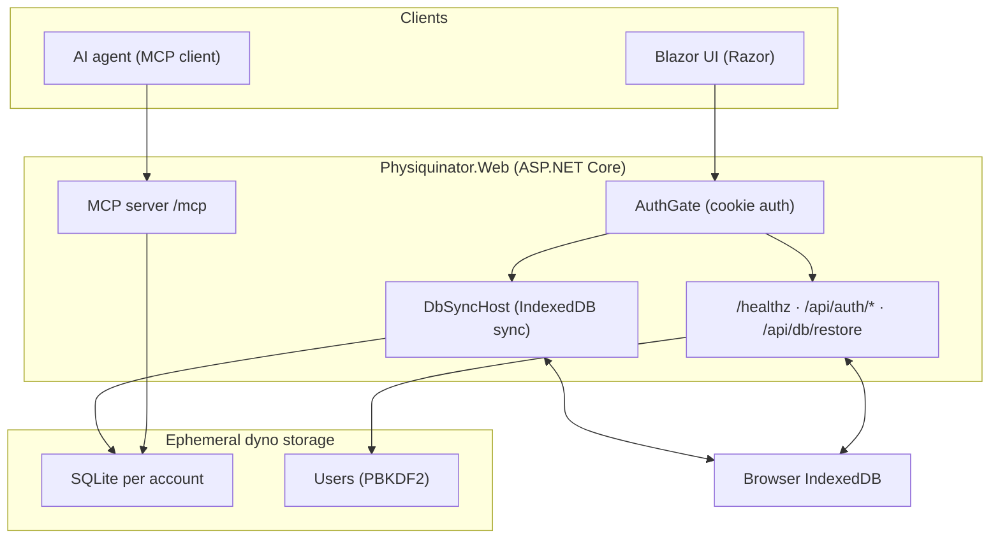

# Physiquinator

<div align="center">


[](https://github.com/tothKarolyDavid/Physiquinator/actions/workflows/ci.yml)
[](https://github.com/tothKarolyDavid/Physiquinator/releases/latest)

A cross-platform workout tracking app built with **.NET MAUI and Blazor Hybrid**. Plan workouts, log sets with a smart rest timer, track progress and personal records, and ask an on-device AI assistant to analyze your training - all backed by a local SQLite database that works offline.

It also ships a **web client with a Model Context Protocol (MCP) server**, so any AI agent (Claude, Cursor, Copilot) can query your workout history and manage your plans.

[Preview](#preview) · [Download & Install](#download--install) · [Live Demo (Web)](#live-demo-web) · [Features](#features) · [Agent API (MCP)](#agent-api-mcp-server) · [Architecture](#architecture) · [Tech Stack](#tech-stack) · [Getting Started](#getting-started) · [Testing & CI](#testing--ci)

</div>

---

## Preview

<div align="center">

<p align="center">
<strong>Live workout</strong> · <strong>Plans home</strong> · <strong>AI assistant</strong><br><br>
<picture>
  <source media="(prefers-color-scheme: dark)" srcset="./docs/rest-timer-dark.png">
  
</picture>
&nbsp;&nbsp;
<picture>
  <source media="(prefers-color-scheme: dark)" srcset="./docs/home-dark.png">
  
</picture>
&nbsp;&nbsp;
<picture>
  <source media="(prefers-color-scheme: dark)" srcset="./docs/ai-chat-dark.png">
  
</picture>
</p>

<br>

<p align="center">
<strong>Activity history</strong> · <strong>Session summary</strong> · <strong>Exercise detail</strong><br><br>
<picture>
  <source media="(prefers-color-scheme: dark)" srcset="./docs/history-dark.png">
  
</picture>
&nbsp;&nbsp;
<picture>
  <source media="(prefers-color-scheme: dark)" srcset="./docs/session-details-dark.png">
  
</picture>
&nbsp;&nbsp;
<picture>
  <source media="(prefers-color-scheme: dark)" srcset="./docs/exercise-progression-dark.png">
  
</picture>
</p>

<br>

<p align="center">
<strong>Create plan</strong> · <strong>Edit plan</strong> · <strong>Settings</strong><br><br>
<picture>
  <source media="(prefers-color-scheme: dark)" srcset="./docs/create-plan-dark.png">
  
</picture>
&nbsp;&nbsp;
<picture>
  <source media="(prefers-color-scheme: dark)" srcset="./docs/edit-plan-dark.png">
  
</picture>
&nbsp;&nbsp;
<picture>
  <source media="(prefers-color-scheme: dark)" srcset="./docs/settings-dark.png">
  
</picture>
</p>

</div>

---

## Download & Install

**Latest Release**: [](https://github.com/tothKarolyDavid/Physiquinator/releases/latest)

| Platform | Package | Size | Requirements |
|----------|---------|------|--------------|
| Android | [Physiquinator-Android.apk](https://github.com/tothKarolyDavid/Physiquinator/releases/latest/download/Physiquinator-Android.apk) | ~115 MB | Android 7.0+ |
| Windows | [Physiquinator-Windows.zip](https://github.com/tothKarolyDavid/Physiquinator/releases/latest/download/Physiquinator-Windows.zip) | ~70 MB | .NET 11 Desktop Runtime* |

**\*.NET 11 Desktop Runtime is free from Microsoft and installs in ~5 minutes (one-time setup)**  
Download: https://dotnet.microsoft.com/download/dotnet/11.0

> **Windows Users**: See [WINDOWS-INSTALL.md](WINDOWS-INSTALL.md) for installation instructions and troubleshooting.

**Android:**
1. Enable "Install from Unknown Sources" in **Settings** → **Security**
2. Transfer the APK to your device
3. Open the APK file and tap **Install**
4. Launch **Physiquinator** and start tracking!

**Windows:**
1. Extract the ZIP file
2. Run `Physiquinator.exe`
3. No installation required - runs standalone!

> **Tip:** The app includes sample workout plans to get you started immediately!

---

## Live Demo (Web)

The web client is deployed to Heroku via GitHub Actions (`.github/workflows/deploy-heroku.yml`) on every push to `main`:

**<https://physiquinator-web.herokuapp.com>** - open the link and hit **Try the demo** for instant access (or sign in as `demo` / `demo1234`, or create your own account).

> The URL above is a placeholder for your app. Create the Heroku app, set the GitHub secrets, and update the link (see [Deploy the Web App to Heroku](#deploy-the-web-app-to-heroku)).

What the web client includes: the full Blazor UI, an MCP agent API at `/mcp`, per-account data isolation, security headers, rate limiting, and a readiness probe at `/healthz`.

---

## Features

### AI Assistant
- **In-app chat** - Ask questions about your training in natural language, with streaming responses
- **15 built-in tools** - Create and edit plans, log bodyweight, pull history stats and exercise progression, control rest-timer and app settings
- **Five provider presets** - OpenAI, OpenRouter, OpenCode, a fully local [Ollama](https://ollama.com) setup, or any custom OpenAI-compatible API
- **Agent API** - The same tools are exposed to external AI agents over MCP (see [Agent API](#agent-api-mcp-server))

### Workout Plans
- **Custom plans** - Design routines with unlimited exercises, per-exercise rest intervals and set counts
- **One-tap start** - Jump straight into a workout from the home screen
- **Quick edit** - Modify plans anytime to match your progress

### Smart Rest Timer
- **Wall-clock countdown** - Accurate down to the second, driven by a single in-flight JS bridge call
- **Android floating overlay** - A draggable picture-in-picture bubble stays visible when you switch to another app (e.g. YouTube or a browser); add time, reset, skip, or log a set without opening Physiquinator
- **Alerts (Android/iOS)** - Optional sound, vibration, and local notifications when rest ends, plus exact alarms that survive Doze mode. On desktop/web the countdown runs in-app only
- **Full control** - Add time (with quick presets), reset, or skip rest periods

### Live Workout Tracking
- **Real-time progress** - Completed vs. remaining sets with progress bars
- **Set logging** - Granular rep count, weight, and metric editing mid-workout, with undo
- **Mobile-optimized** - Upcoming exercises shown first on small screens
- **Post-workout summary** - Duration, volume, and every personal record earned during the session

### History & Analytics
- **Activity heatmap** - GitHub-style consistency grid over 53 weeks, marking missed scheduled days
- **Exercise progression** - Per-exercise charts to track strength over time
- **Personal records** - Automatic bests for weight, reps, volume, and session duration
- **Bodyweight tracking** - Log and chart bodyweight alongside your training
- **Workout schedule** - Set training days so rest days never break your streak
- **Session history** - Detailed review of completed sessions and set logs

### User Profiles
- **Multi-user support** - Isolated profiles, each with its own plans, history, and bodyweight log
- **Easy switching** - Move between profiles in one tap

### Data Management
- **Local SQLite storage** - Fast, offline-first persistence
- **JSON backup** - Export and import plans and history, merged by session and set ID
- **Demo data seeding** - Sample workouts and plans on first launch so you can explore immediately

### Other
- **Automatic updates** - Checks GitHub Releases and installs new versions in-app (Android and Windows)
- **Cross-platform UI** - Light and dark themes, phone-first layout that also runs on tablets and desktop

---

## Agent API (MCP Server)

The web client (`Physiquinator.Web`) exposes the AI assistant's tools over the [Model Context Protocol](https://modelcontextprotocol.io) (Streamable HTTP, 2026-07-28 spec). Any MCP-compatible agent harness can connect by URL - no per-client code:

| Client | How to connect |
|--------|----------------|
| Claude Desktop / Cursor / any MCP host | Add a server with URL `https://your-host/mcp` |
| MCP Inspector | Pick "Streamable HTTP", enter `http://localhost:5000/mcp` |

All in-app assistant tools (`get_workout_plans`, `create_workout_plan`, `log_bodyweight_entry`, `get_workout_history_stats`, and more) are exposed automatically with JSON schemas and read-only/destructive annotations. Destructive tools (`delete_workout_plan`, `delete_bodyweight_entry`) ask the user for explicit confirmation via the protocol's multi-round-trip `input_required` mechanism before executing; clients on older protocol revisions run them directly.

Configuration (`appsettings.json` or env vars):

```json
"Mcp": {
  "ApiKey": "",        // REQUIRED in production: requests must send X-Api-Key or Authorization: Bearer
  "CorsOrigins": ""    // comma-separated origins for browser-based clients (e.g. Copilot)
}
```

In production the MCP endpoint **rejects all requests unless `Mcp__ApiKey` is set** as a Heroku config var (or the `X-Api-Key` / `Authorization: Bearer` header matches). Without it you will see a warning in the logs and 401s on `/mcp`. The endpoint is rate limited per client IP.

State is isolated per client: database connections, preferences, and session state are scoped per Blazor circuit, and MCP requests resolve those services in their own scope, so concurrent clients never share an in-memory workout or settings store. The server emits per-tool telemetry through `ILogger` and ships a `/healthz` probe:

```bash
curl -X POST http://localhost:5000/mcp \
  -H "Content-Type: application/json" \
  -d '{"jsonrpc":"2.0","id":1,"method":"tools/list"}'
```

---

## Architecture

The app is split into four projects, all sharing one domain model and service layer:

```
Physiquinator.Core   Domain model, SQLite repositories, and all business logic
                     (workouts, history, stats, AI assistant, backup, updates)
Physiquinator.UI     Blazor Hybrid UI (Razor class library): pages, components, theming
Physiquinator        Platform hosts: .NET MAUI shell for Android/iOS/Windows/macOS
Physiquinator.Web    ASP.NET Core web host: same UI as a Blazor web app + MCP server
Physiquinator.Tests  xUnit test suite (277 tests) covering repositories, services,
                     formatting, and the MCP surface
```



Key design points:

- **Blazor Hybrid everywhere** - The exact same Razor UI runs natively via WebView2 (MAUI) and in the browser (Web), so every page is tested and built once
- **Platform services behind interfaces** - Notifications, vibration, file transfer, and update installation are abstracted (`INotificationService`, `IVibrationService`, ...) with real, no-op, and test-double implementations
- **Android overlay as a foreground service** - The floating rest timer is a draggable overlay hosted in a foreground service with exact alarms, so it keeps running when the app is backgrounded
- **A single service registry** - `AddPhysiquinatorServices()` in the Core project is shared by both hosts, keeping the web client feature-complete with zero duplication; stateful services (database, session, rest timer, profile) are singletons on MAUI and scoped per Blazor circuit on the web host

---

## Tech Stack

### Core
- **[.NET 11](https://dotnet.microsoft.com/)** - Target framework for all projects
- **[.NET MAUI](https://dotnet.microsoft.com/apps/maui)** - Cross-platform native shell (Android, iOS, macOS, Windows)
- **[Blazor Hybrid](https://learn.microsoft.com/aspnet/core/blazor/hybrid/)** - Rich web UI in native apps
- **[SQLite](https://www.sqlite.org/)** via [sqlite-net-pcl](https://github.com/praeclarum/sqlite-net) - Local, offline-first storage

### UI & Styling
- **[MudBlazor](https://mudblazor.com/)** - Material Design component library
- **[Markdig](https://github.com/xoofx/markdig)** - Markdown rendering for AI responses
- **Custom CSS animations** - Smooth, modern UI effects with light and dark themes

### AI & Agents
- **OpenAI-compatible client** - SSE streaming, tool-call loops, reasoning content
- **[Ollama](https://ollama.com)** - Local, private inference provider
- **[ModelContextProtocol.AspNetCore](https://github.com/modelcontextprotocol/csharp-sdk)** - MCP server over Streamable HTTP

### Platform
- **[Plugin.LocalNotification](https://github.com/thudugala/Plugin.LocalNotification)** - Cross-platform notifications
- **MAUI Essentials** - File picker, share, vibration APIs
- **Android foreground services** - Floating overlay, exact alarms, broadcast receivers

### Tooling
- **GitHub Actions** - CI (build, test, format), SonarCloud analysis, signed release builds
- **Playwright + WebView2 CDP** - Automated screenshot generation (`tools/screenshot-generator`)

---

## Getting Started

### Prerequisites

- **[.NET 11 SDK](https://dotnet.microsoft.com/download/dotnet/11.0)** (preview; pinned in `global.json`)
- **[Visual Studio 2026](https://visualstudio.microsoft.com/)** with the MAUI workload, or **Visual Studio Code** with the C# Dev Kit
- **Android SDK** for Android development, **Xcode** for iOS/macOS (Mac only)

### Quick Start

```bash
git clone https://github.com/tothKarolyDavid/Physiquinator.git
cd Physiquinator

dotnet restore

# Run on Windows
dotnet build -t:Run -f net11.0-windows10.0.19041.0

# Run on Android (device/emulator)
dotnet build -t:Run -f net11.0-android

# Run the web client (includes the MCP server on /mcp)
dotnet run --project Physiquinator.Web

# Run the tests
dotnet test Physiquinator.Tests/Physiquinator.Tests.csproj
```

### Build a release APK without an Android SDK (Docker)

```powershell
docker build -t physiquinator-android -f Dockerfile.android .
docker create --name temp physiquinator-android
docker cp temp:/app/output/com.companyname.physiquinator-Signed.apk ./Physiquinator.apk
docker rm temp
```

See [DOCKER.md](DOCKER.md) for complete Docker setup and troubleshooting.

### Regenerate screenshots

```powershell
cd tools/screenshot-generator
.\run.ps1     # builds the Windows app, then captures every screen into docs/
```

---

## Deploy the Web App to Heroku

The web client (`Physiquinator.Web`, Blazor Server UI + MCP server) ships as a Docker container and deploys to Heroku with a GitHub Actions workflow (`.github/workflows/deploy-heroku.yml`), which runs the tests, builds the image, scans it with Trivy, and releases only if everything passes.

**Prerequisites**: [GitHub Student Developer Pack](https://education.github.com/pack) (free Heroku credits), Heroku CLI, a GitHub repo of this project.

1. **Create the app**: `heroku create physiquinator-web`
2. **Set config vars** (replace with real values):
   ```bash
   heroku config:set ASPNETCORE_ENVIRONMENT=Production
   heroku config:set Mcp__ApiKey=your-mcp-key          # REQUIRED - /mcp rejects everything without it
   heroku config:set Mcp__CorsOrigins=                 # optional: browser-based MCP clients
   heroku config:set AUTH_DEMO_USERNAME=demo           # optional: demo account login
   heroku config:set AUTH_DEMO_PASSWORD=demo1234       # optional: demo account password
   ```
3. **Set GitHub secrets**: `HEROKU_API_KEY` (from `heroku authorizations:create`), `HEROKU_APP_NAME`, `HEROKU_EMAIL`. For best practice, store them in a GitHub Environment named `production` (repo secrets work too).
4. **Push to `main`** — the workflow tests, builds, scans, and releases automatically. Deploy manually anytime from the Actions tab.

Test the container locally:

```bash
docker build -t physiquinator-web .
docker run -p 8080:8080 -e PORT=8080 physiquinator-web
# open http://localhost:8080  ·  health probe: http://localhost:8080/healthz
```

> **Accounts & data**: every account gets its own SQLite database (`physiquinator_{userId}.db3`), and the databases are mirrored to the browser's IndexedDB every ~15 seconds while the page is open, so data survives dyno restarts. Registration is open; the demo account (`demo` / `demo1234`, overridable via `AUTH_DEMO_USERNAME` / `AUTH_DEMO_PASSWORD`) is seeded automatically and can be entered with one click from the login screen.

> **Security baseline**: cookie auth (SameSite=Lax, HTTPS-only), security headers incl. CSP (same-origin scripts only), rate limiting on auth/MCP/restore endpoints, PBKDF2 password hashes, and an ephemeral-storage readiness probe at `/healthz`. Known limitation: auth cookies are encrypted with ephemeral DataProtection keys, so dyno restarts sign everyone out once (the data itself is safe); re-login is one click for demo visitors.

---

## Testing & CI

- **277 xUnit tests** covering repositories, workout/session/history services, stats and formatting, the AI tool registry, and the MCP surface
- **CI on every push/PR** - restore, build, test, and `dotnet format` verification (`.github/workflows/ci.yml`)
- **SonarCloud analysis** with coverage for Core, UI, Web, and Tests (`.github/workflows/sonarcloud.yml`)
- **Tag-based releases** (`v*`) - signed Android APK and Windows package built and published automatically (`.github/workflows/release.yml`)
- **Heroku deploys** - the deploy workflow re-runs the tests, builds the Docker image, scans it with Trivy, and releases when green (`.github/workflows/deploy-heroku.yml`)
- **Dependabot** - weekly dependency updates for NuGet and GitHub Actions (`.github/dependabot.yml`)
- **Web E2E (local)** - a Playwright suite in `tools/web-e2e` covers registration/login, seeded plans, and the IndexedDB sync roundtrip:

  ```bash
  cd tools/web-e2e
  npm install
  npx playwright install chromium
  npm test    # requires the web app running on localhost:8080 (PLAYWRIGHT_BASE_URL overrides)
  ```

---

## Key Design Decisions

### Why .NET MAUI + Blazor Hybrid?
- **Single codebase** - Write the UI once in Razor, run it natively on every platform
- **Web skills** - Full use of HTML/CSS while keeping native performance and platform APIs
- **Familiar stack** - Leverages existing .NET and web development knowledge

### Why SQLite?
- **Offline-first** - Works without an internet connection
- **Fast** - Excellent performance for local queries
- **Cross-platform** - The same database file format on every platform, and per-profile isolation is trivial

### Why an MCP server?
- The workout data is already structured and local - exposing it through a standard agent protocol turns the app into a personal training copilot for any AI tool, with the same safety confirmation flow as the in-app assistant.
