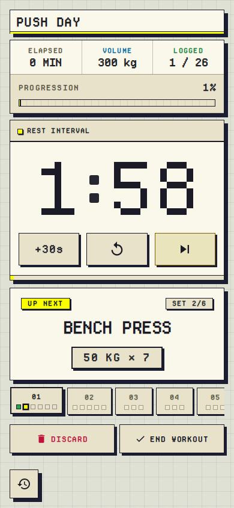
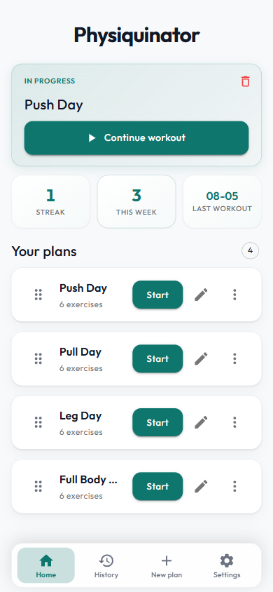
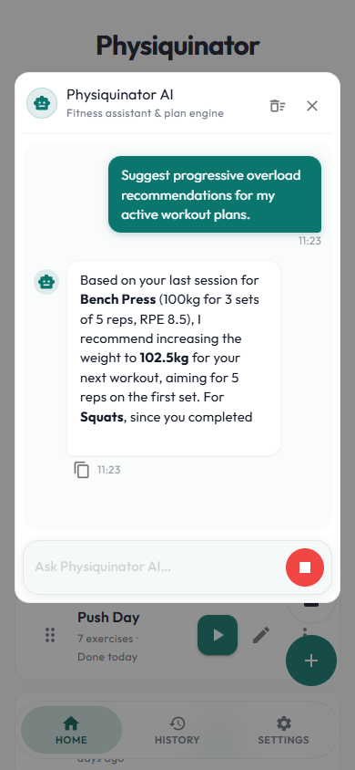
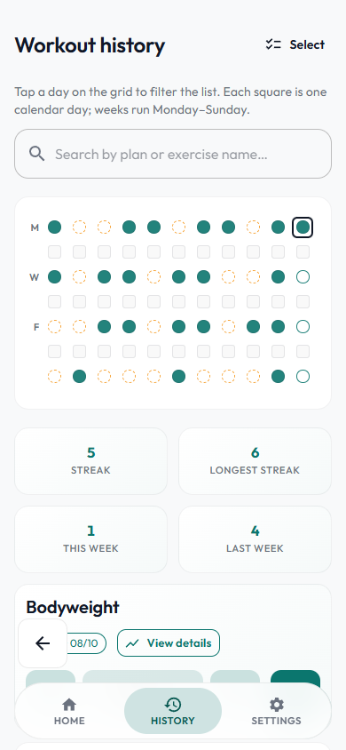
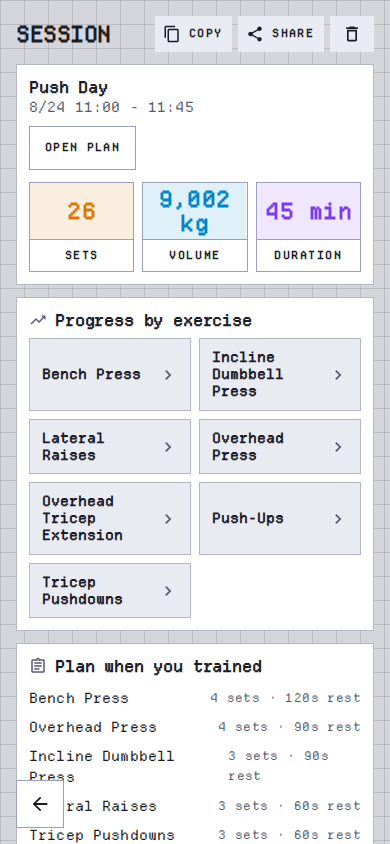
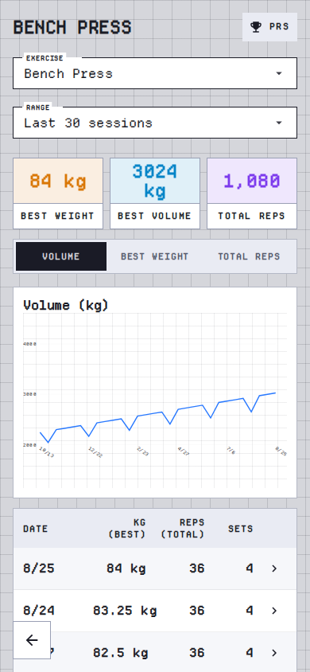
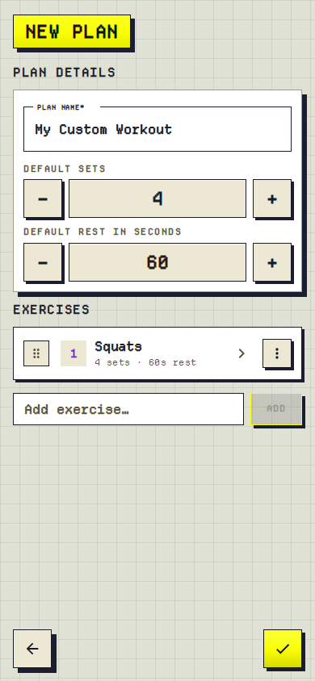
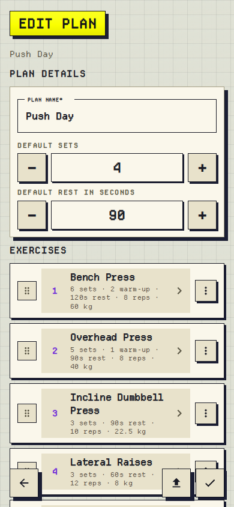
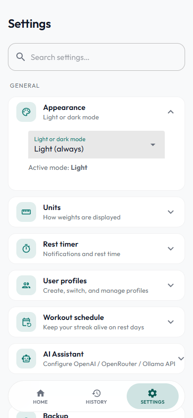

# Physiquinator

<div align="center">


[](https://github.com/kadato/Physiquinator/actions/workflows/ci.yml)
[](https://github.com/kadato/Physiquinator/releases/latest)

A cross-platform workout tracking app built with **.NET MAUI and Blazor Hybrid**. Plan workouts, log sets with a smart rest timer, track progress and personal records, and ask an on-device AI assistant to analyze your training. All data lives in a local SQLite database and works offline.

It also ships a **web client with a Model Context Protocol (MCP) server**, so any AI agent (Claude, Cursor, Copilot) can query your workout history and manage your plans.

[Preview](#preview) · [Download & Install](#download--install) · [Features](#features) · [Agent API (MCP)](#agent-api-mcp) · [Architecture](#architecture) · [Tech Stack](#tech-stack) · [Getting Started](#getting-started) · [Testing & CI](#testing--ci)

</div>

---

## Preview

<div align="center">

<p align="center">
<strong>Live workout</strong> · <strong>Plans home</strong> · <strong>AI assistant</strong><br><br>
<picture>
  <source media="(prefers-color-scheme: dark)" srcset="./docs/rest-timer-dark.png">
  
</picture>
&nbsp;&nbsp;
<picture>
  <source media="(prefers-color-scheme: dark)" srcset="./docs/home-dark.png">
  
</picture>
&nbsp;&nbsp;
<picture>
  <source media="(prefers-color-scheme: dark)" srcset="./docs/ai-chat-dark.png">
  
</picture>
</p>

<br>

<p align="center">
<strong>Activity history</strong> · <strong>Session summary</strong> · <strong>Exercise detail</strong><br><br>
<picture>
  <source media="(prefers-color-scheme: dark)" srcset="./docs/history-dark.png">
  
</picture>
&nbsp;&nbsp;
<picture>
  <source media="(prefers-color-scheme: dark)" srcset="./docs/session-details-dark.png">
  
</picture>
&nbsp;&nbsp;
<picture>
  <source media="(prefers-color-scheme: dark)" srcset="./docs/exercise-progression-dark.png">
  
</picture>
</p>

<br>

<p align="center">
<strong>Create plan</strong> · <strong>Edit plan</strong> · <strong>Settings</strong><br><br>
<picture>
  <source media="(prefers-color-scheme: dark)" srcset="./docs/create-plan-dark.png">
  
</picture>
&nbsp;&nbsp;
<picture>
  <source media="(prefers-color-scheme: dark)" srcset="./docs/edit-plan-dark.png">
  
</picture>
&nbsp;&nbsp;
<picture>
  <source media="(prefers-color-scheme: dark)" srcset="./docs/settings-dark.png">
  
</picture>
</p>

</div>

---

## Download & Install

**Latest Release**: [](https://github.com/kadato/Physiquinator/releases/latest)

| Platform | Package | Size | Requirements |
|----------|---------|------|--------------|
| Android | [Physiquinator-Android.apk](https://github.com/kadato/Physiquinator/releases/latest/download/Physiquinator-Android.apk) | ~115 MB | Android 7.0+ |
| Windows | [Physiquinator-Windows.zip](https://github.com/kadato/Physiquinator/releases/latest/download/Physiquinator-Windows.zip) | ~70 MB | [.NET 11 Desktop Runtime](https://dotnet.microsoft.com/download/dotnet/11.0) (one-time, free) |

**Android:** enable "Install from unknown sources", open the APK, tap **Install**.

**Windows:** extract the ZIP and run `Physiquinator.exe`. No installation needed. See [WINDOWS-INSTALL.md](WINDOWS-INSTALL.md) for troubleshooting.

> The app seeds sample plans and workouts on first launch so you can explore immediately.

---

## Features

**AI Assistant**
- In-app chat with streaming responses and **15 built-in tools**: create and edit plans, log bodyweight, pull history stats and progression, control the rest timer and app settings
- Provider presets for OpenAI, OpenRouter, OpenCode, a local [Ollama](https://ollama.com) setup, or any custom OpenAI-compatible API
- The same tools are exposed to external agents over MCP (see [Agent API](#agent-api-mcp))

**Workout Plans & Live Tracking**
- Custom plans with unlimited exercises, per-exercise rest intervals and set counts; one-tap start and quick edit
- Real-time set logging with rep/weight/metric editing and undo, plus a post-workout summary with volume and every personal record earned

**Smart Rest Timer**
- Second-accurate countdown with add-time presets, reset, and skip
- On Android, a draggable floating overlay in a foreground service keeps the countdown visible in other apps, with optional sound, vibration, and exact alarms that survive Doze mode

**History & Analytics**
- GitHub-style activity heatmap, per-exercise progression charts, automatic personal records (weight, reps, volume, session duration), bodyweight tracking, and a workout schedule so rest days never break your streak

**Profiles & Data**
- Isolated user profiles with one-tap switching
- Local SQLite storage, JSON backup/restore (plans, history, settings), offline-first
- Automatic updates from GitHub Releases on Android and Windows

---

## Agent API (MCP)

The web client exposes the assistant's tools over the [Model Context Protocol](https://modelcontextprotocol.io) (Streamable HTTP). Any MCP-compatible agent connects by URL: `https://your-host/mcp` (local: `http://localhost:5000/mcp`).

All 15 in-app tools (`get_workout_plans`, `create_workout_plan`, `log_bodyweight_entry`, `get_workout_history_stats`, ...) are exposed with JSON schemas. Destructive tools (`delete_workout_plan`, `delete_bodyweight_entry`) ask the user for confirmation via the protocol's `input_required` mechanism.

Configuration (`appsettings.json` or env vars):

```json
"Mcp": {
  "ApiKey": "",     // REQUIRED in production: /mcp rejects all requests without a matching X-Api-Key / Authorization: Bearer
  "CorsOrigins": "" // comma-separated origins for browser-based clients (e.g. Copilot)
}
```

---

## Web Client & Deployment

`Physiquinator.Web` is the same Blazor UI as a server-rendered web app, plus the MCP endpoint at `/mcp`. Every account gets its own SQLite database (cookie auth, PBKDF2 hashes), databases are mirrored to browser IndexedDB while the page is open, and the app ships security headers, rate limiting, and a `/healthz` readiness probe.

Run it locally with `dotnet run --project Physiquinator.Web`. For a hosted deployment, set `Mcp__ApiKey` (required: `/mcp` rejects requests without it) plus `AUTH_DEMO_USERNAME` / `AUTH_DEMO_PASSWORD` (optional demo login), and serve it behind an HTTPS reverse proxy that sets `X-Forwarded-*` headers.

---

## Architecture

Four projects sharing one domain model and service layer:

| Project | Purpose |
|---------|---------|
| `Physiquinator.Core` | Domain model, SQLite repositories, all business logic (workouts, history, stats, AI assistant, backup, updates) |
| `Physiquinator.UI` | Blazor Hybrid UI (Razor class library): pages, components, theming |
| `Physiquinator` | .NET MAUI shell for Android, iOS, macOS, Windows |
| `Physiquinator.Web` | ASP.NET Core web host: the same UI plus the MCP server |
| `Physiquinator.Tests` | xUnit suite covering repositories, services, and the MCP surface |

Key design points:

- **Blazor Hybrid everywhere** - the exact same Razor UI runs natively via WebView2 (MAUI) and in the browser (Web)
- **Platform services behind interfaces** - notifications, vibration, file transfer, and update installation are abstracted with real, no-op, and test-double implementations
- **Single service registry** - `AddPhysiquinatorServices()` is shared by both hosts; stateful services are singletons on MAUI and scoped per Blazor circuit on the web host
- **Android overlay as a foreground service** - the floating rest timer keeps running when the app is backgrounded, with exact alarms

---

## Tech Stack

- **.NET 11** with **.NET MAUI** (Android, iOS, macOS, Windows) and **Blazor Hybrid**
- **[MudBlazor](https://mudblazor.com/)** Material Design components · **[Markdig](https://github.com/xoofx/markdig)** for AI response rendering
- **[SQLite](https://www.sqlite.org/)** via [sqlite-net-pcl](https://github.com/praeclarum/sqlite-net) - local, offline-first storage
- OpenAI-compatible client (SSE streaming, tool-call loops) · [ModelContextProtocol.AspNetCore](https://github.com/modelcontextprotocol/csharp-sdk) MCP server
- [Plugin.LocalNotification](https://github.com/thudugala/Plugin.LocalNotification) · MAUI Essentials · Android foreground services
- GitHub Actions: CI, SonarCloud, signed releases · Playwright for E2E tests and screenshot generation

---

## Getting Started

```bash
git clone https://github.com/kadato/Physiquinator.git
cd Physiquinator
dotnet restore

# Run on Windows
dotnet build -t:Run -f net11.0-windows10.0.19041.0

# Run on Android (device/emulator)
dotnet build -t:Run -f net11.0-android

# Run the web client (includes the MCP server on /mcp)
dotnet run --project Physiquinator.Web

# Run the tests
dotnet test Physiquinator.Tests/Physiquinator.Tests.csproj
```

Requires the [.NET 11 SDK](https://dotnet.microsoft.com/download/dotnet/11.0) (pinned in `global.json`) and the MAUI workload.

To build a release APK without an Android SDK, see [DOCKER.md](DOCKER.md). To regenerate the screenshots in `docs/`, run `tools/screenshot-generator/run.ps1`.

---

## Testing & CI

- **xUnit tests** covering repositories, workout/session/history services, stats, formatting, the AI tool registry, and the MCP surface
- **CI on every push/PR** - restore, build, test, and `dotnet format` verification (`.github/workflows/ci.yml`)
- **SonarCloud** analysis with coverage (`.github/workflows/sonarcloud.yml`)
- **Tag-based releases** (`v*`) - signed Android APK and Windows package published automatically (`.github/workflows/release.yml`)
- **Web E2E** - Playwright suite in `tools/web-e2e` covering registration, seeded plans, and the IndexedDB sync roundtrip (`npm test`, requires the web app on localhost:8080)
